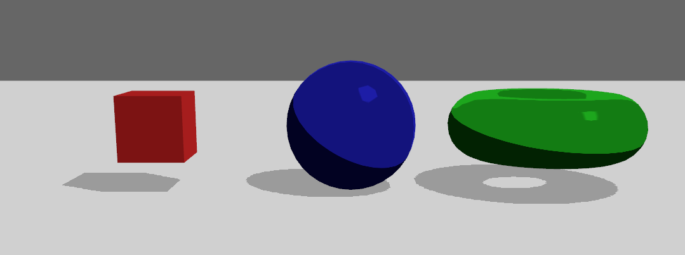

# Bevy Toon Material

A work-in-progress toon material for the Bevy game engine.

## Roadmap

- Convert to library

- Add base color texture

- Add outlines?

- Add normal map?

## Reference

- [Bevy](https://github.com/bevyengine/bevy)
- [Custom Toon Shader in Three.js](https://www.maya-ndljk.com/blog/threejs-basic-toon-shader)
- [Toon Shader using Unity engine](https://roystan.net/articles/toon-shader/)
